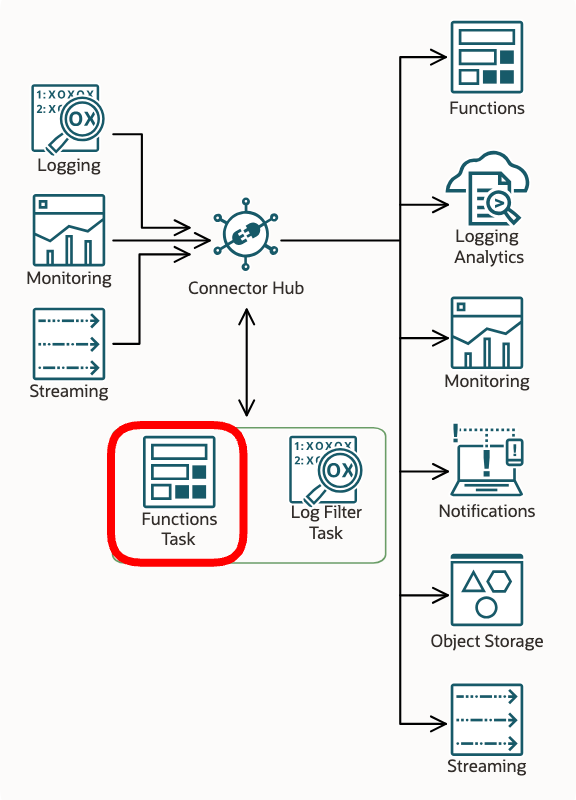
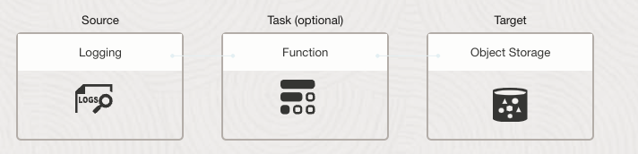

# Enriching Log and Metric Event Payloads with OCI Tags

---

### Why are Tags not Present on Log and Metric Events?

OCI supports a robust [Tagging](https://docs.oracle.com/en-us/iaas/Content/Tagging/Concepts/taggingoverview.htm) 
feature that allows customers to tag provisioned objects as needed to meet virtually any business use case.
However, most OCI services don't include OCI tags when they emit logs
and metrics to [Logging](https://docs.oracle.com/en-us/iaas/Content/Logging/home.htm) and 
[Monitoring](https://docs.oracle.com/en-us/iaas/Content/Monitoring/home.htm) 
because including tags would be expensive, adversely impacting storage and bandwidth usage.

### Common Use Cases

Many customer use cases, however, call for a way to map log and metric events to business objects so 
that downstream systems (such as a SIEM) can build correlations.  Thus, they need
events with tags included.

### Solution Brief

This sample solves that problem through the use of
[OCI Service Connector Function Tasks](https://docs.oracle.com/en-us/iaas/Content/connector-hub/overview.htm). 
The sample Function Task can be used to "enrich" event payloads by retrieving and adding `freeform`, `defined` 
and/or `system` tags associated with the Oracle Cloud IDs (OCIDs) present in the payload.  

See [OCI Service Connector Overview](https://docs.oracle.com/en-us/iaas/Content/connector-hub/overview.htm) for 
a thorough explanation of Functions Tasks.



----


## Functions Primer

If you’re new to Functions, get familiar by running through 
the [Quick Start guide on OCI Functions](http://docs.oracle.com/en-us/iaas/Content/Functions/Tasks/functionsquickstartguidestop.htm) before proceeding.


## IAM Setup

### OCI Compartment

For illustration purposes, we will define a compartment with the name `tag-enrichment-comp`.


### OCI Policy

Since the functions task uses the OCI SDK to retrieve tags, it will need permissions to do so.  

#### Dynamic Group

Functions are resources in OCI IAM parlance, do we need to set up a dynamic group called `tag-enrichment-dynamic-group` 
that includes function resources in the compartment.  The OCID should be the one corresponding to `tag-enrichment-comp`.

```
resource.compartment.id = 'ocid1.compartment.oc1....'
```

#### Policies

Next we need to grant the task the ability to search the various types of OCI resources we have in our use case.
In the below example, some sample permissions are present as a guide.  For example, your function may need to 
retrieve the tags for VCNs, subnets, buckets and objects in `tag-enrichment-comp`, or it may need to get tags for 
any resource in the compartment.  Adjust this as needed for your use case.

```
Allow dynamic-group tag-enrichment-dynamic-group to use tag-namespaces in compartment tag-enrichment-comp
Allow dynamic-group tag-enrichment-dynamic-group to manage object-family in compartment tag-enrichment-comp
Allow dynamic-group tag-enrichment-dynamic-group to manage virtual-network-family in compartment tag-enrichment-comp
Allow dynamic-group tag-enrichment-dynamic-group to manage all-resources in compartment tag-enrichment-comp
Allow dynamic-group tag-enrichment-dynamic-group to manage compartments in compartment tag-enrichment-comp
```

## Function Setup

See the [Quick Start guide on OCI Functions](http://docs.oracle.com/en-us/iaas/Content/Functions/Tasks/functionsquickstartguidestop.htm) reference.
This task supports a number of configuration options (see below).

### Testing the Function by Invoking it Locally

Once you have the Fn Application created, Function built and deployed to the Application, we can perform some tests
from the cloud shell without having to set up a Service Connector. Using the OCI Console, add a `freeform` tag to 
the VCN subnets you created for the Fn Application.  An example freeform tag:

    "app-test": "working" 

Invoke the function by passing it a simulated event payload that looks like this:

    {
      "id": "your-vcn-id-goes-here"
    }

Now let's invoke the Function from the directory in cloud shell where the function code is located, 
passing in a simulated 'event' payload like so:

    echo -n '{"id":"your-vcn-subnet-ocid-goes-here"}' | fn invoke tag-enrichment-app oci-tag-enrichment-task

You should see the same payload returned with `tags` collection added ... something like this:

    {
        "id": "ocid1.subnet.oc1.iad....",
        "tags": {
            "ocid1.subnet.oc1.iad....": {
                "freeform": {
                    "VCN": "VCN-2024-03-01T20:57:32"
                    "app-test": "working"
                }
            }
        }
    }

## Function Configuration

Here are the supported configuration parameters.  See below for examples of what they do. The defaults are fine 
for most use cases.

| Environment Variable     |          Default          | Purpose                                                                                                                                                                                                                                                                                                     |
|--------------------------|:-------------------------:|:------------------------------------------------------------------------------------------------------------------------------------------------------------------------------------------------------------------------------------------------------------------------------------------------------------|
| TARGET_OCID_KEYS         |                           | By default, tags are assembled for all OCIDs in the event payload.  To select only specific ones, simply provide a comma-separated list of OCID keys (l-values) in the JSON.                                                                                                                                |
| INCLUDE_TAG_TYPES        | freeform, defined, system | By default, `'freeform'`, `'defined'` and `'system'` tag will be included when found. See [OCI Tagging Overview](https://docs.oracle.com/en-us/iaas/Content/Tagging/Concepts/taggingoverview.htm).                                                                                                          |
| INCLUDE_EMPTY_TAGS_TYPES |           False           | By default, empty tag type collections are not included.                                                                                                                                                                                                                                                    |
| TAG_ASSEMBLY_KEY         |           tags            | The `TAG_ASSEMBLY_KEY` is the dictionary key `l-value` used to add the tag collection to the event JSON payload.                                                                                                                                                                                            |
| TAG_POSITION_KEY         |                           | If empty (the default), the tag collection is placed at the root of the event JSON.  Otherwise, you can set `TAG_POSITION_KEY` to an existing payload `l-value` to place the tag collection there. Note: If the `l-value` is not found or the `r-value` is not an object or an array, an exception is thrown. |
| LOGGING_LEVEL            |           INFO            | Controls function logging outputs.  Choices: INFO, WARN, CRITICAL, ERROR, DEBUG                                                                                                                                                                                                                             |


### TARGET_OCID_KEYS

The default behavior is to collect and attach all tags for all OCIDs present in an event payload.
If you only want to target specific OCID keys to retrieve, define the list 
of `TARGET_OCID_KEYS` to search for in the event payloads. Set the `TARGET_OCID_KEYS` to a comma-separated 
list of OCID keys (l-values in the payload) to include. Target OCIDs can exist _anywhere_ in the event payload, 
and will be found regardless of nested position.


###  TAG_ASSEMBLY_KEY

The l-value `"tags"` `l-value` can be customized.  Simply set `TAG_ASSEMBLY_KEY` to name it whatever you like.

###  TAG_POSITION_KEY

If you want to position the tag collection somewhere other than at the payload root, you can set `TAG_POSITION_KEY`.
For example, look at this sample OCI Monitoring Metric event payload:

    {
        "namespace": "oci_vcn",
        "resourceGroup": null,
        "compartmentId": "ocid1.compartment.oc1..",
        "name": "VnicEgressDropsConntrackFull",
        "dimensions": {
            "resourceId": "ocid1.subnet.oc1.phx...",
        },
        "metadata": {
            "displayName": "Egress Packets Dropped by Full Connection Tracking Table",
            "unit": "packets"
        },
        "datapoints": [
            {
                "timestamp": 1652196492000,
                "value": 0.0,
                "count": 1
            }
        ]
    }

If we want the tags deposited within the `metadata` object, setting `TAG_POSITION_KEY` == `metadata`, which will
add the tags there:

    {
        "namespace": "oci_vcn",
        "resourceGroup": null,
        "compartmentId": "ocid1.compartment.oc1..",
        "name": "VnicEgressDropsConntrackFull",
        "dimensions": {
            "resourceId": "ocid1.subnet.oc1.phx...",
        },
        "metadata": {
            "displayName": "Egress Packets Dropped by Full Connection Tracking Table",
            "unit": "packets",
            "tags": {
                "ocid1.compartment.oc1...": {
                    "freeform": {
                        "enrichment": "True",
                        "testing": "True"
                    },
                    "defined": {
                        "OracleInternalReserved": {
                            "OwnerEmail": "foo@bar.com"
                        }
                    }
                },
                "ocid1.subnet.oc1.phx....": {
                    "freeform": {
                        "VCN": "VCN-2024-03-01T20:57:32"
                    }
                }
            }
        },
        "datapoints": [
            {
                "timestamp": 1652196492000,
                "value": 0.0,
                "count": 1
            }
        ]
    }

### Important TAG_POSITION_KEY Caveat

If the `TAG_POSITION_KEY` is defined and that `l-value` is not present in the payload, an error is thrown.


## Service Connector Setup

As a sample test scenario, let's write tag-enriched `VCN Flow Logs` to an `Object Storage Bucket`.




**Configure VCN Tags**
* Just use the VCN that the Function App requires.
* Add freeform or defined tags to the subnets on your VCN in `tag-enrichment-comp`.

**Configure VCN Flow Logs**
* Enable VCN Flow logs for the VCN in `tag-enrichment-comp`.

**Create Object Storage**
* Create a bucket in `tag-enrichment-comp`.

**Create Service Connector**
* Create a service connector instance in `tag-enrichment-comp`.
* Configure it to:
  * Select VCN Flow Logs as Source
  * Select Functions Task and point to this Task Function
  * Select Object Storage as Target

_NOTE: BE SURE TO ACCEPT THE POLICY UPDATES THE SERVICE CONNECTOR DIALOG OFFERS YOU!_

## Troubleshooting

### Enable Fn Application Invocation Logs

If you are getting an unexpected behavior, enable the function invocation logs for the Function App.  
Then set `LOGGING_LEVEL` == `DEBUG` to have the function write full debugging output to that log.

### Task function is timing out

You can reduce the amount of work passed to the Task Function to resolve this. Edit the Task portion of 
the Service Connector, click `Show additional options` and then `Use manual settings`. Set `Batch size limit (KBs)` 
to a smaller number to reduce the batch size.  Conversely, you can extend the time limit by 
increasing `Batch time limit (seconds)`.

### Task function is not adding any tags

The function must have `resource principal` permissions granted to it in order to successfully
retrieve tags for a given Object.  See Dynamic Group & Policies discussion above. 

If the invocation logs show the search API is being successfully called for an OCID but no tags are returned, you probably are 
seeing an [auth issue](https://docs.oracle.com/en-us/iaas/Content/connector-hub/overview.htm#Authenti). Modify 
your policy to grant the Function resource appropriate access. 

### Task function is not adding the target tags

If you have `TARGET_OCID_KEYS` set, be sure you have the correct OCID `keys` (l-values) in 
your `TARGET_OCID_KEYS` and that the delimiter is a comma or space. Use the invocation logs to confirm that 
the function is searching for the OCID key.   

### Task function is adding stale tags

This function has a cache which it uses to avoid making unnecessary search API calls. Tag values rarely change so
the cache should not be an issue.  However, you can clear the cache by causing the Service Connector to restart 
the Function container.  The easiest way to do that is to change a Fn Application configuration parameter.

----


## License
Copyright (c) 2014, 2023 Oracle and/or its affiliates
The Universal Permissive License (UPL), Version 1.0
